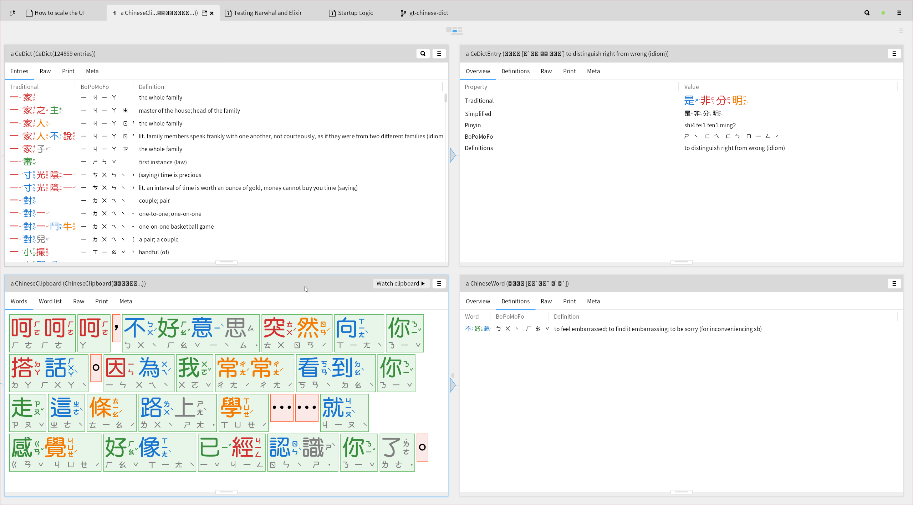
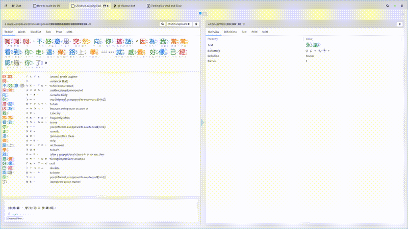

#+TITLE: GT Chinese Dictionary
#+AUTHOR: mariari

A Chinese clipboard dictionary for [[https://gtoolkit.com][Glamorous Toolkit]]. Copy a sentence
from a game, book, or webpage — GT segments the Chinese text into
words and shows each word with BoPoMoFo and English definitions.

* Features

- *Dictionary*: Loads [[https://cc-cedict.org][CC-CEDICT]] (~120k entries) into the image, indexed by traditional Chinese
- *Segmentation*: Greedy longest-match (up to 6 characters) splits text into words
- *BoPoMoFo*: Full pinyin to BoPoMoFo conversion table
- *Tone coloring*: Each character colored by its tone — red (1st), orange (2nd), green (3rd), blue (4th), gray (neutral)
- *Clipboard watching*: Polls the system clipboard every second, auto-segments new Chinese text
- *GT views*: Colored word chips, word list, per-entry definitions — all inspectable
- *Spotter search*: Search dictionary entries from any CeDict object (Ctrl+P)
- *Font fallback*: Prefers DFPYuanW7-ZhuIn (has inline zhuyin), falls back to Source Han Sans TW

* Installation

#+begin_src smalltalk
Metacello new
    baseline: 'GtChineseDict';
    repository: 'gitlocal:///path/to/gt-chinese-dict';
    load.
#+end_src

The dictionary downloads automatically on first use (~4 MB from MDBG).

* Usage

#+begin_src smalltalk
"Open with clipboard watching and history"
ChineseClipboardHistory open startPolling.
#+end_src

Copy Chinese text from anywhere — it auto-segments, shows tone-colored
characters with BoPoMoFo, and keeps a history of all lookups. Click any
word chip for definitions, arrow through the list to highlight words in
the reading view.

* Classes

| Class               | Role                                                                         |
|---------------------+------------------------------------------------------------------------------|
| CeDict              | Dictionary: loads CC-CEDICT, indexes by traditional, segments text           |
| CeDictEntry         | One dictionary entry: traditional, simplified, pinyin, bopomofo, definitions |
| ChineseWord         | A segmented word with its matching dictionary entries                        |
| ChineseClipboard    | Clipboard tool: polls, segments, GT views with tone colors                   |
| ChineseClipboardHistory | Entry point: wraps clipboard with history of all lookups                 |
| PinyinBopomofo      | Pinyin to BoPoMoFo conversion table                                          |
| ChineseToneColor    | Tone number to color mapping                                                 |
| ChineseDictExamples | GT examples covering all classes                                             |

* License

Dictionary data: CC-CEDICT is licensed under [[https://creativecommons.org/licenses/by-sa/4.0/][CC BY-SA 4.0]].
